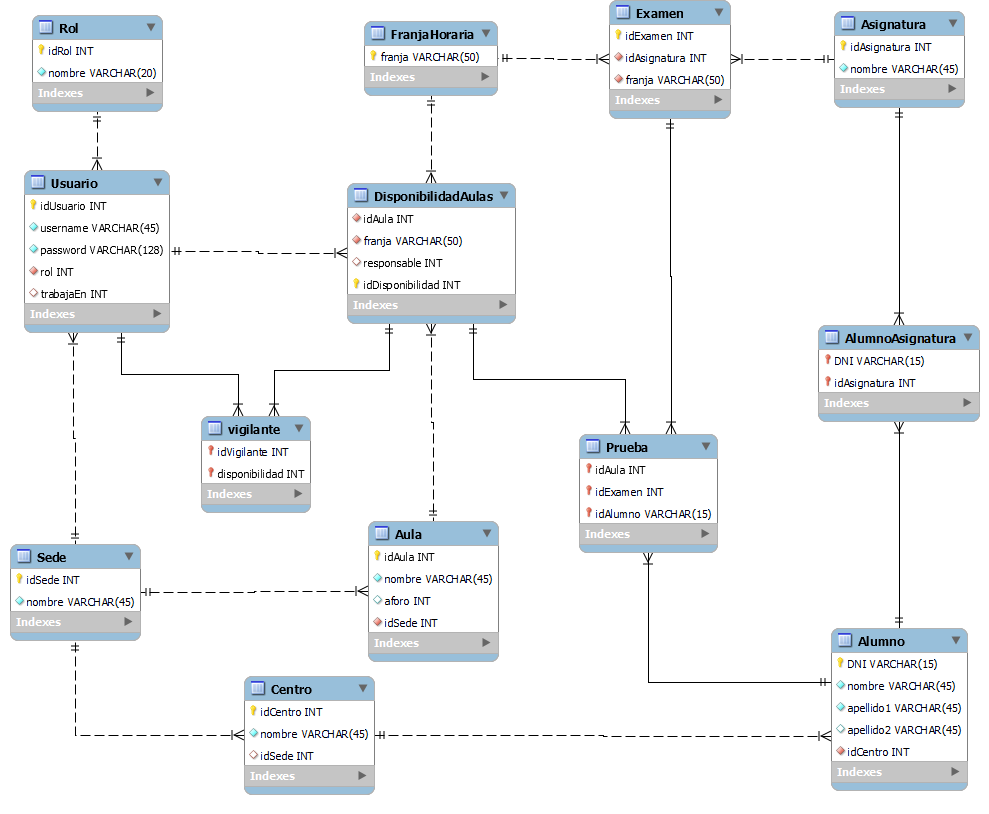

# Dolly
Dolly (nombre provisional) es un sistema para la gestión de la PEvAU.
# Lenguajes
C# y SQL.
# Servicios
Para el desarrollo de la aplicación han sido usadas las aplicaciones de MySQL y Visual Basic, junto a los servicios de bases de datos de AWS

# Desarrolladores
- Lucía
- Javier
- Illya
- José
